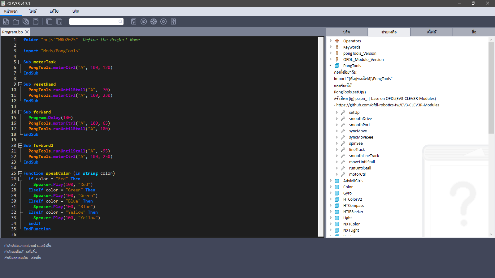

# Clev3r Mods Thai

> **Clev3r 1.3 เวอร์ชั่นนี้ดัดแปลงมาจากเวอร์ชั่น Clev3r 1.7.1.0 และอัลกอริทึมจาก OFDL**

## ฟีเจอร์ใหม่

- **PongTools (lib):** ฟังก์ชั่นพื้นฐานสำหรับควบคุมหุ่นยนต์สำหรับการแข่ง WRO  
- **PongTools (Help):** หน้าต่างอธิบายคำสั่งต่างๆว่าใช้งานอย่างไร  
- **ภาษาไทย:** แทนที่ภาษา English ด้วยภาษาไทย (ในโปรแกรมจะเห็นตัวเลือกภาษาเป็น ไทย)  
- **ธีมสี:** ปรับแต่งธีมสีเล็กน้อย (เลือกได้ว่าจะลงไหม)  
  - หากต้องการเปลี่ยนธีมทีหลัง ให้คลิกขวาที่ "หน้าแรก" → "การตั้งค่า"

## วิธีใช้งานเบื้องต้น

ศึกษาการใช้งานเบื้องต้นได้ใน `Programs\Program.bp`  
**หากจะเขียนโปรแกรมในโฟลเดอร์ที่อยู่ Path อื่น ให้คัดลอกโฟลเดอร์ Mods ไปด้วยเพื่อใช้งาน PongTools**

---

*Modified by p.spn_ (Instagram)*